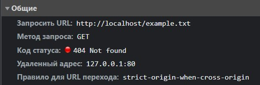

## Низкоуровневая работа с веб

### Цель работы

Освоить основные навыки обращения c Web из программы на Python, средства парсинга веб-страниц, соответствующие библиотеки.

1. При ответе вашего сервера посылайте некоторые основные заголовки:
    1. Date
    2. Content-type
    3. Server
    4. Content-length
    5. Connection: close.

2. Создайте файл настроек вашего веб-сервера, в котором можно задать прослушиваемый порт, рабочую директорию, максимальный объем запроса в байтах. Можете добавить собственные настройки по желанию.

3. Если файл не найден, сервер передает в сокет специальный код ошибки - 404.

4. Сервер должен работать в многопоточном режиме.

5. Сервер должен вести логи в следующем формате: Дата запроса. IP-адрес клиента, имя запрошенного файла, код ошибки.

6. Добавьте возможность запрашивать только определенные типы файлов (.html, .css, .js и так далее). При запросе неразрешенного типа, верните ошибку 403.

7. Реализуйте поддержку постоянного соединения с несколькими запросами.

8. Реализуйте поддержку бинарных типов данных, в частночти, картинок.

